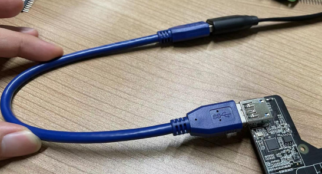
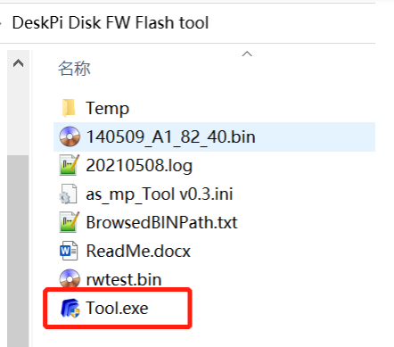
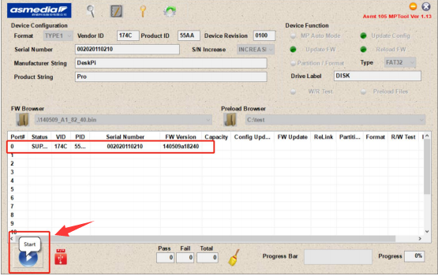
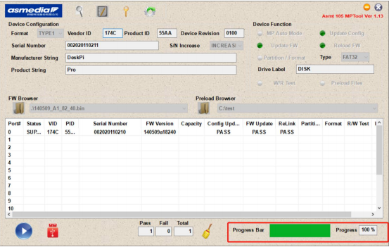
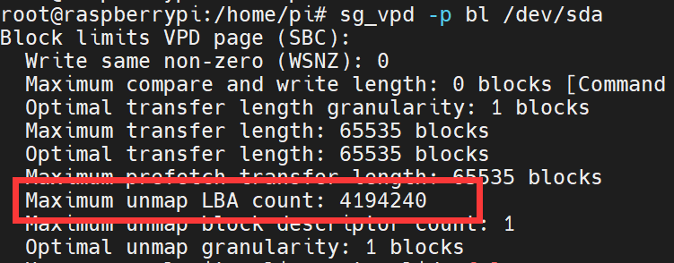
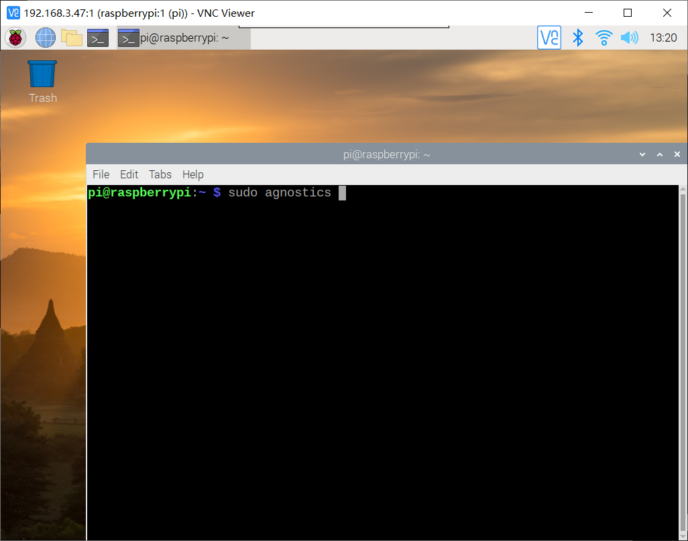
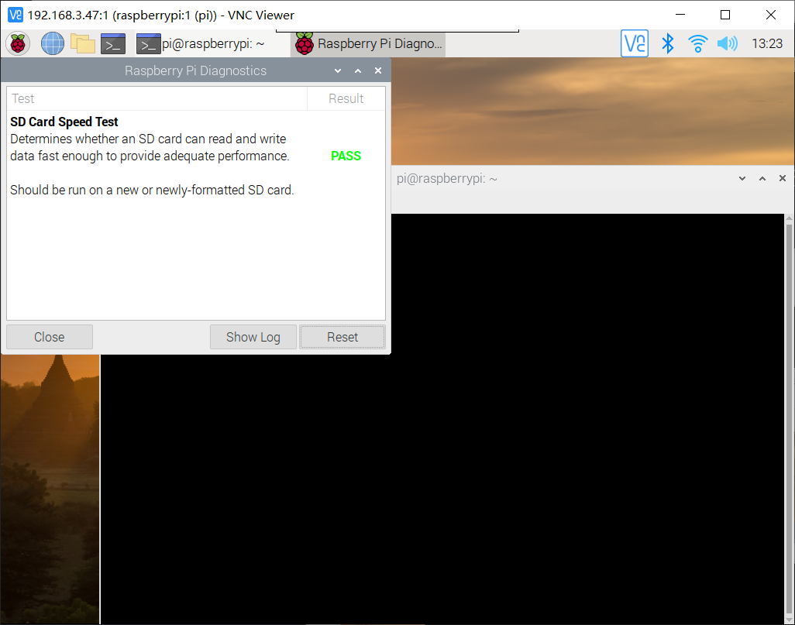
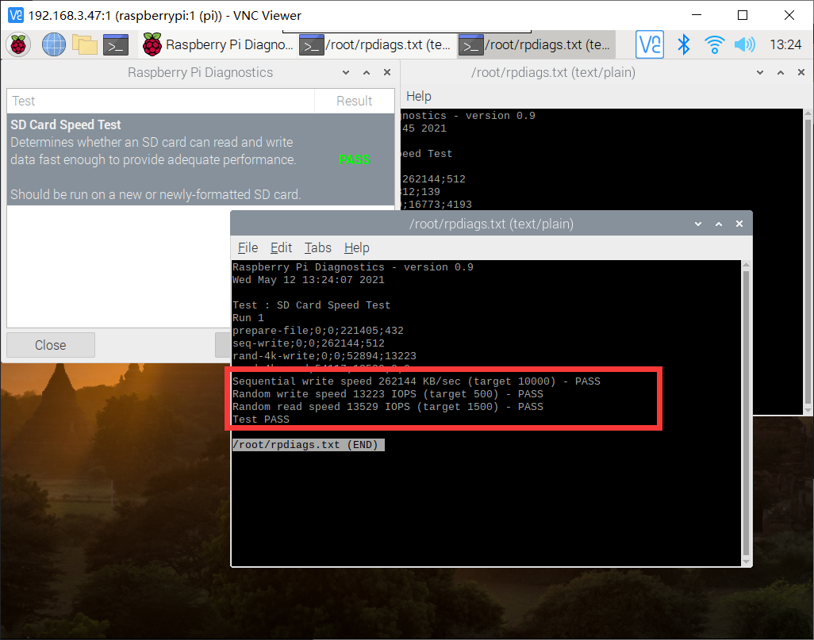

# DeskPi Pro V3 Firmware update Manual
## Description
In order to better obtain the performance of the SSD drive, you can update the firmware and enable the trim function. Please follow the operation method below to update the firmware.
## What you need?
1.  1 x USB-A to USB-A Cable 
2.  1 x Windows PC 
3.  1 x DeskPi Pro V3 Daughter board 
4.  1 x DeskPi Disk FW Flash Tool Pack  
## Firmware update Method:
1. Use USB-A to USB-A Cable（2.0 or 3.0）connect the disk
board to PC, or connect the plug directly to PC



2. Unpack DeskPI Disk FW Flash Tool, and double click `Tool.exe`

3. Confirm the board has been found, click Start button. Wait for a moment。

When the progress bar is 100%, you can unplug the DeskPi Pro Daughter board and install the Raspberry Pi on the DeskPi Pro.


## How to enable trim on Raspberry Pi OS?
1. Check if SSD supports TRIM?  Execute folloing command in terminal:
```bash
sudo fstrim -v /
```
If this reports back
```bash 
fstrim: /: the discard operation is not supported, then TRIM is not enabled.
```
You can also check with:
```bash
lsblk -D
```
If the `DISC-MAX` value is `0B`, then TRIM is not enabled.

2. Checking if the Firmware supports TRIM? 
```bash 
sudo apt-get -y install sg3-utils lsscsi
```
Run the following command and check the `Maximum unmap LBA count`:
by this command : 
```bash
sg_vpd -p bl /dev/sda
```
it will show this:
```bash
sg_vpd -p bl /dev/sda
Block limits VPD page (SBC):
...
  Maximum unmap LBA count: 4194240
  Maximum unmap block descriptor count: 1
...
```
Take note of it, then run the following command and check the` Unmap command supported (LBPU)`:
```bash
sg_vpd -p lbpv /dev/sda
```
It will show:
```bash
Logical block provisioning VPD page (SBC):
  Unmap command supported (LBPU): 1
...
```
If the` Maximum unmap LBA count` is greater than `0`, and `Unmap command supported (LBPU)` is `1`, then the device firmware likely supports TRIM.

<font color=red> Warning: </font>some device run fstrim command  may corrupt the drive's firmware, to the point it won't mount and can't be formatted anymore. So make sure you have a backup of any important data before you try on a drive that might not actually support TRIM!
## Enable TRIM 
 Check on the current `provisioning_mode` for all drives attached to the Pi:
```bash
find /sys/ -name provisioning_mode -exec grep -H . {} + | sort
```
if you see something like this:
```bash
/sys/devices/platform/scb/fd500000.pcie/pci0000:00/0000:00:00.0/0000:01:00.0/usb2/2-1/2-1:1.0/host0/target0:0:0/0:0:0:0/scsi_disk/0:0:0:0/provisioning_mode:full
```
Change the `provisioning_mode` from `full` to `unmap`; but if you have more than one drive attached, you need to confirm which drive you need to change. You can do that using lsscsi:
```bash
lsscsi
```

Once you've confirmed which drive you need to change, change the value from `full` to `unmap` in the path that the find command returned:
```bash
echo unmap > /sys/devices/platform/scb/fd500000.pcie/pci0000:00/0000:00:00.0/0000:01:00.0/usb2/2-1/2-1:1.0/host0/target0:0:0/0:0:0:0/scsi_disk/0:0:0:0/provisioning_mode
```
Run the find command again to confirm the `provisioning_mode` is now `unmap`:
```bash
find /sys/ -name provisioning_mode -exec grep -H . {} + | sort
```
result: 
```bash
/sys/devices/platform/scb/fd500000.pcie/pci0000:00/0000:00:00.0/0000:01:00.0/usb2/2-1/2-1:1.0/host0/target0:0:0/0:0:0:0/scsi_disk/0:0:0:0/provisioning_mode:unmap
```

Now, you need to update the `discard_max_bytes` value for the drive, based on the `Maximum unmap LBA count` value you got from the `sg_vpd -p bl /dev/sda` command earlier, times the `Logical block length` value you get from the `sg_readcap -l /dev/sda` command. your values may be different:


```bash
echo $((4194240*512))
```
result : 2147450880
Then write that value into the drive's `discard_max_bytes` setting. 
```bash
echo 2147450880 > /sys/block/sda/queque/discard_max_bytes
```
Now, to confirm TRIM is enabled, run:
```bash
fstrim -v  /
```

 it could take a few seconds 
 ## Make it available after rebooting Pi.
These values will all be reset next time you reboot the Pi.  To make the rules stick, you need to add a udev rule:
```bash
sudo nano /etc/udev/rules.d/10-trim.rules
```
And add the following in that file:
```bash
ACTION=="add|change", ATTRS{idVendor}=="174c", ATTRS{idProduct}=="55aa", SUBSYSTEM=="scsi_disk", ATTR{provisioning_mode}="unmap"
```

 you can get the `idVendor` and `idProduct`by using  `lsusb` utility:
```bash
lsusb
```


And looking at the 'ASMedia' line, the vendor is the first part of the identifier (174c), and the product is the second part (55aa). 
Make sure to save your `10-trim.rules` file, then `reboot`the Pi. 
Try running `fstrim` again, and make sure it works:
```bash
sudo fstrim -v /
/: 102.3 GiB (109574424254 bytes) trimmed
```
The first time fstrim is run after a reboot, it will trim all the free space, which is why it gives such a large number. From that point on, the kernel will track changed blocks and trim only that data until the next boot.
## How to enable Automatic trimming
make sure the TRIM command is run automatically in the background is to enable the built-in `fstrim.timer`.

To do that, run the command:
```bash 
sudo systemctl enable fstrim.timer
```
## How to diagnostic Disk speed:
1. Install agnostic software
```bash
sudo apt-get -y install agnostic
```

2. Execute following command  in terminal on desktop
```bash
sudo agnostics
```

3. Press `Run tests`

4. After testing.Press `show log` bottom.

and you will get the result of your SSD speed testing.


